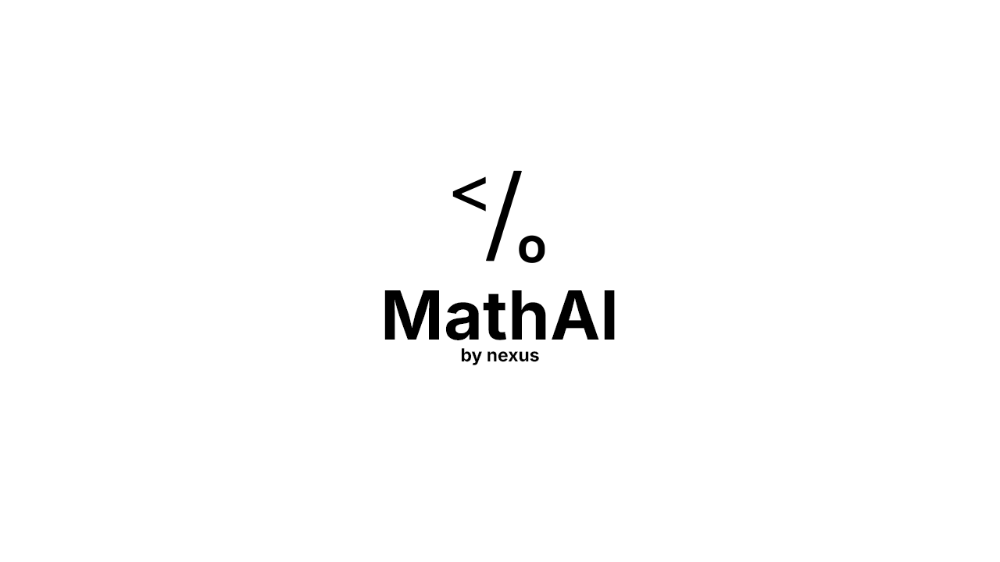

<h1 align="center"> MathAI - Smart Math Problem Solver</h1>

<div align="center">
  
  <p><strong>Instantly solve complex mathematical problems with AI-powered step-by-step explanations.</strong></p>
</div>

## 🚀 About MathAI

MathAI is a powerful web application built with Next.js that allows users to solve a wide range of mathematical problems. Leveraging the powerful WolframAlpha computational engine, MathAI provides detailed step-by-step solutions to help students, educators, and professionals understand the solution process, not just the final answer.

This project was created as a single-developer effort to make advanced mathematical problem-solving more accessible to everyone.

## ✨ Features

- **Comprehensive Problem Solving**: Solve equations, systems of equations, calculus problems, matrix operations, and more
- **Step-by-Step Solutions**: Get detailed explanations for every step of the solution process
- **WolframAlpha Integration**: Powered by the world-renowned computational engine for accurate results
- **History Management**: Keep track of previously solved problems
- **PDF Export**: Save solutions as PDF files for later reference
- **Dark Mode Support**: Choose between light and dark themes for comfortable viewing
- **Mobile Responsive**: Works seamlessly on desktop, tablet, and mobile devices

## 🛠️ Technologies Used

- **Frontend**: Next.js, React, TypeScript
- **Styling**: Tailwind CSS
- **Math Rendering**: KaTeX
- **Animation**: Framer Motion
- **PDF Generation**: html2canvas, jsPDF
- **API Integration**: WolframAlpha API
- **Local Computation**: Math.js (fallback when API is unavailable)

## 📋 Prerequisites

- Node.js (v18.0.0 or later)
- npm (v9.0.0 or later)
- WolframAlpha API key (optional, but recommended for best results)

## 🔧 Installation

1. Clone the repository:
   ```bash
   git clone https://github.com/nexusdevv/math-ai.git
   cd math-ai
   ```

2. Install dependencies:
   ```bash
   npm install
   ```

3. Set up environment variables:
   - Create a `.env.local` file in the root directory
   - Add your WolframAlpha API key:
     ```
     NEXT_SECRET_WOLFRAM_APP_ID=your-api-key-here
     ```

4. Start the development server:
   ```bash
   npm run dev
   ```

5. Open your browser and navigate to `http://localhost:3000`

## 🖥️ Usage

1. Enter a mathematical problem in the input field
2. Click "Solve" to get a step-by-step solution
3. View the solution, which includes:
   - Problem description
   - Step-by-step working
   - Alternative forms
   - Visual representations (when applicable)
   - Final answer
4. Export to PDF if needed for later reference
5. Access your history to revisit previously solved problems

### 💡 Supported Problem Types

- **Algebraic Equations**: `2x + 3 = 7`, `x^2 + 4x - 5 = 0`
- **Systems of Equations**: `solve the system: x + y = 10, 2x - y = 5`
- **Calculus**: 
  - Integration: `integrate x^2 + 3x + 2`
  - Differentiation: `differentiate sin(x) * cos(x)`
- **Linear Algebra**: 
  - Determinants: `find the determinant of [[1,2,3],[4,5,6],[7,8,9]]`
  - Matrices operations (coming soon)
- **Variable Solving**: `find the x: 3x + 2 = 14`
- **Natural Language Queries**: You can also talk directly to WolframAlpha using natural language!

## 📱 Screenshots

<div align="center">
  
  
  <p><em>Home screen and About page examples</em></p>
</div>

<div align="center">
  
  
  <p><em>Dark mode and mobile responsive design</em></p>
</div>

## 🚧 Future Enhancements

- Enhanced visualization for functions and equations
- Support for more problem types (probability, statistics, etc.)
- Interactive step-by-step solutions with user controls
- User accounts to save favorite problems
- Native mobile apps

## ⚠️ Note on API Usage

While we strive to provide accurate solutions, please note that:

1. Results from WolframAlpha may occasionally contain errors
2. The free tier of WolframAlpha API has limitations
3. Complex problems may require specialized expertise to verify

Always double-check important solutions against other sources!

## 📄 License

This project is licensed under the GPL-3.0 License - see the [LICENSE](LICENSE) file for details.

## 🙏 Acknowledgements

- [WolframAlpha](https://www.wolframalpha.com/) for their powerful computational engine
- [Next.js](https://nextjs.org/) for the React framework
- [Tailwind CSS](https://tailwindcss.com/) for styling
- [KaTeX](https://katex.org/) for beautiful math rendering
- [Framer Motion](https://www.framer.com/motion/) for smooth animations

---

<div align="center">
  <p>Created with Next.js by Nexus</p>
  <p>© 2025 MathAI. All rights reserved.</p>
</div>
